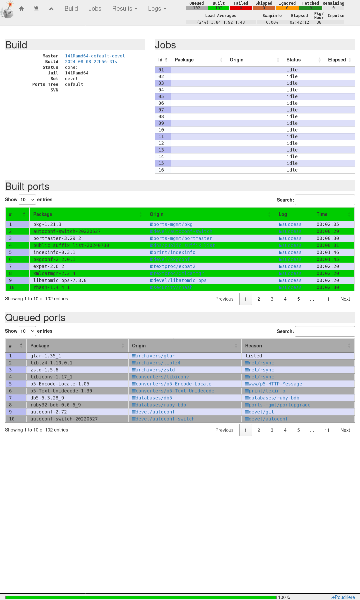

.. _ug_build_141amd64_minimal:

Build 14.1 amd64 minimal pkg list
^^^^^^^^^^^^^^^^^^^^^^^^^^^^^^^^^

Create jail ::

   shell> poudriere jail -c -j 141Ramd64 -v 14.1-RELEASE -a amd64

Create ports tree ::
    
   shell> poudriere ports -c -m git+https -B main

Build ports listed in the file *minimal* ::

   shell> poudriere bulk -j 141Ramd64 -z devel -f /usr/local/etc/poudriere.d/pkglist/amd64/minimal

Look at the results. See the section :ref:`ug_build_export` how to configure the web server.

https://build.example.com/logs/bulk/141Ramd64-default-devel/latest/build.html

