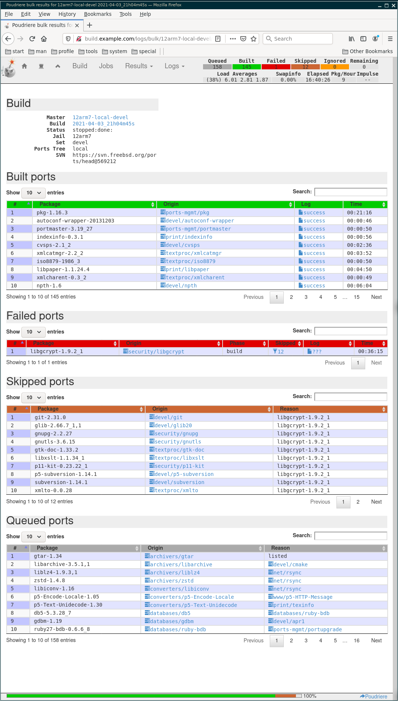

.. _ug_build_12arm7:

Build armv7 packages
^^^^^^^^^^^^^^^^^^^^

Poudriere requires `QEMU <https://www.qemu.org/>`_ to cross-building ports for arm on amd64. Install
the package manually or use Ansible role `vbotka.freebsd_postinstall <https://ansible-freebsd-postinstall.readthedocs.io/en/latest/index.html>`_ ::

   shell> cat host_vars/build.example.com/fp-qemu.yml
   ---
   fp_qemu: true
   fp_qemu_enabled: true
   # mutually exclusive
   fp_qemu_install: false
   fp_qemu_user_static_install: true
   # set to the name of the installed package
   fp_qemu_rcvar: qemu_user_static

   shell> ansible-playbook freebsd-postinstall.yml -t fp_packages
   shell> ansible-playbook freebsd-postinstall.yml -t fp_qemu

Make sure `QEMU <https://www.qemu.org/>`_ is running ::

   shell> /usr/local/etc/rc.d/qemu_user_static list

.. seealso::

   * `Building Packages Through Emulation <https://wiki.freebsd.org/Ports/BuildingPackagesThroughEmulation>`_
   * `Building ARM Packages with Poudriere <https://forums.freebsd.org/threads/building-arm-packages-with-poudriere-the-simple-way.52994/>`_

Simplify the creation of the arm jail and avoid building the base system. Instead, download and
mount an image into the directory */usr/local/poudriere/jails/*. Create the memory disk (*vnode*)
and mount it manually or use Ansible role `vbotka.freebsd_postinstall <https://ansible-freebsd-postinstall.readthedocs.io/en/latest/index.html>`_ ::

  shell> cat host_vars/build.example.com/fp-mount-img.yml
  ---
  fp_mount_img: true
  fp_mount_img_entries:
    - img: /export/img/FreeBSD-12.2-RELEASE-arm-armv7-CUBOX-HUMMINGBOARD.img
      mount: /usr/local/poudriere/jails/12arm7
      fstype: ufs
      partition: s2a

.. seealso::

   * `Where is the arm/armv6 source? <https://forums.freebsd.org/threads/where-is-the-arm-armv6-source.61542/>`_

.. toctree::
   :caption: Examples
   :name: _ug_build_12rm7_toc

   example-poudriere-jail-create-12arm7
   example-poudriere-ports-create
   example-poudriere-options-12arm7
   example-poudriere-bulk-minimal-12arm7

http://build.example.com/logs/bulk/12arm7-local-devel/latest/build.html

.. note::

   Meanwhile, the failed port `security/libgcrypt was fixed <https://github.com/freebsd/freebsd-ports/blob/c51dc27dae149df8d61ea457b03599adb8ec56c1/security/libgcrypt/Makefile#L40>`_
