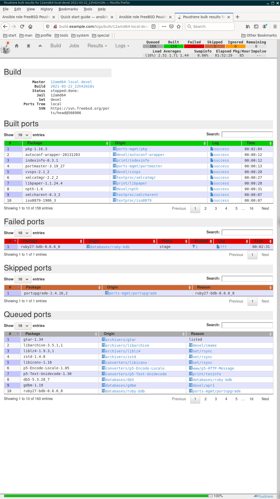

.. _ug:

############
User's guide
############
.. contents:: Table of Contents
   :depth: 4

.. _ug_introduction:

^^^^^^^^^^^^
Introduction
^^^^^^^^^^^^

* Ansible role: `freebsd_poudriere <https://galaxy.ansible.com/vbotka/freebsd_poudriere/>`_
* Supported systems: `FreeBSD <https://www.freebsd.org/releases/>`_
* Requirements: None

Poudriere is a BSD-licensed utility for creating and testing FreeBSD packages. To learn details see the references below

.. seealso::

   * FreeBSD Handbook `4.6. Building Packages with Poudriere <https://docs.freebsd.org/en_US.ISO8859-1/books/handbook/ports-poudriere.html>`_

   * FreeBSD Porter's Handbook `10.5. Poudriere <https://docs.freebsd.org/en/books/porters-handbook/index.html#testing-poudriere>`_

   * FreeBSD Wiki `Poudriere: Getting Started - Tutorial <https://wiki.freebsd.org/VladimirKrstulja/Guides/Poudriere>`_

   * DO Tutorials `How To Set Up a Poudriere Build System to Create Packages for your FreeBSD Servers <https://www.digitalocean.com/community/tutorials/how-to-set-up-a-poudriere-build-system-to-create-packages-for-your-freebsd-servers>`_

.. _ug_role:

^^^^^^^^^^^^
Ansible role
^^^^^^^^^^^^

.. _ug_installation:

************
Installation
************

The most convenient way how to install an Ansible role is to use :index:`Ansible Galaxy` CLI
``ansible-galaxy``. The utility comes with the standard Ansible package and provides the user with a
simple interface to the Ansible Galaxy's services. For example, take a look at the current status of
the role

.. code-block:: console
   :emphasize-lines: 1

   shell> ansible-galaxy info vbotka.freebsd_poudriere

and install it

.. code-block:: console
   :emphasize-lines: 1

    shell> ansible-galaxy install vbotka.freebsd_poudriere

.. seealso::

   * To install specific versions from various sources see `Installing content <https://galaxy.ansible.com/docs/using/installing.html>`_

   * Take a look at other roles ``shell> ansible-galaxy search --author=vbotka``

.. _ug_playbook:

********
Playbook
********

Below is a simple playbook that calls this role (6) at a single host build.example.com (3)

.. code-block:: yaml
   :emphasize-lines: 3,6
   :linenos:

   shell> cat pb.yml
   ---
   - hosts: build.example.com
     become: true
     roles:
       - vbotka.freebsd_poudriere

.. seealso::

   * `Understanding Privilege Escalation <https://docs.ansible.com/ansible/latest/user_guide/become.html#understanding-privilege-escalation>`_ (4)

   * `Working with playbooks <https://docs.ansible.com/ansible/latest/user_guide/playbooks.html>`_

.. _ug_debug:

*****
Debug
*****

Enable debug output either in the configuration

.. code-block:: yaml
   :emphasize-lines: 1

   poudriere_debug: true

, or set the extra variable in the command

.. code-block:: console
   :emphasize-lines: 1

   shell> ansible-playbook pb.yml -e poudriere_debug=true

.. note::

   * The debug output of this role is optimized for the **yaml** callback plugin. Set this plugin
     for example in the environment ``shell> export ANSIBLE_STDOUT_CALLBACK=yaml``

   * See details about the yaml callback plugin ``shell> ansible-doc -t callback yaml``

   * See list of other callback plugins ``shell> ansible-doc -t callback -l``

.. seealso::

   * `Playbook Debugger <https://docs.ansible.com/ansible/latest/user_guide/playbooks_debugger.html>`_

   * `Debugging modules <https://docs.ansible.com/ansible/latest/dev_guide/debugging.html#debugging-modules>`_

   * `Python Debugging With Pdb <https://realpython.com/python-debugging-pdb/>`_

.. _ug_tags:

****
Tags
****

The :index:`tags` provide the user with a very useful tool to run selected tasks of the role. To see
what tags are available list the tags of the role with the command

.. include:: tags-list.rst

For example, display the list of the variables and their values with the tag ``poudriere_debug`` (when the
debug is enabled ``poudriere_debug: true``)

.. code-block:: console
   :emphasize-lines: 1

    shell> ansible-playbook playbook.yml -t poudriere_debug

See what packages will be installed

.. code-block:: console
   :emphasize-lines: 1

    shell> ansible-playbook playbook.yml -t poudriere_packages --check

Install packages and exit the play

.. code-block:: console
   :emphasize-lines: 1

    shell> ansible-playbook playbook.yml -t poudriere_packages

.. _ug_vars:

*********
Variables
*********

.. seealso::

   * `Using Variables <https://docs.ansible.com/ansible/latest/user_guide/playbooks_variables.html#using-variables>`_

   * `Ansible variable precedence: Where should I put a variable?
     <https://docs.ansible.com/ansible/latest/user_guide/playbooks_variables.html#variable-precedence-where-should-i-put-a-variable>`_

.. _ug_vars_defaults:
.. include:: vars-defaults.rst

.. _ug_tasks:

*****
Tasks
*****

The groups of tasks stored in separate files comprise

* Display values of the variables. By default disabled (poudriere_debug: false)
* Install packages or ports. By default enabled (poudriere_install: true)
* Generate SSL certificate. By default disabled (poudriere_cert: false)
* Configure Poudriere. By default enabled (poudriere_conf: true)
* Create lists of ports. By default enabled (poudriere_pkglists: true)
* Configure ports' options. By default disabled (poudriere_options: false)
* Customize make. By default enabled (poudriere_make: true)

.. seealso::

   * Source code :ref:`as_main.yml`

.. note::

   * Feel free to `share your feedback and report issues <https://github.com/vbotka/ansible-freebsd-poudriere/issues>`_

   * `Contributions are welcome <https://github.com/firstcontributions/first-contributions>`_

.. _ug_task_packages:
.. include:: task-packages.rst
.. _ug_task_cert:
.. include:: task-cert.rst
.. _ug_task_conf:
.. include:: task-conf.rst
.. _ug_task_pkglist:
.. include:: task-pkglist.rst
.. _ug_task_options:
.. include:: task-options.rst
.. _ug_task_make:
.. include:: task-make.rst

.. _ug_idempotent:

**********************
The role is idempotent
**********************

Except of the certificate's generation, the role is idempotent. The goal is to run the playbook
without any changes after Poudrier is installed and configured, e.g. ::

  shell> ANSIBLE_DISPLAY_OK_HOSTS=false ANSIBLE_DISPLAY_SKIPPED_HOSTS=false ansible-playbook pb.yml

  PLAY [build.example.com] *******************************************************************************
  included: /home/admin/.ansible/roles/vbotka.freebsd_poudriere/tasks/pkglist.yml for build.example.com

  PLAY RECAP *********************************************************************************************
  build.example.com: ok=10   changed=0    unreachable=0    failed=0    skipped=12   rescued=0    ignored=0

.. _ug_poudriere:

^^^^^^^^^
Poudriere
^^^^^^^^^

.. _ug_build:

******************
Build the packages
******************

.. toctree::
   :name: ug_examples_toc

   example-poudriere-jail-create
   example-poudriere-ports-create
   example-poudriere-options
   example-poudriere-bulk-minimal

By default, Poudriere stores the data in ``/usr/local/poudriere/data/`` ::

  [root@build /usr/home/admin]# tree -d -L 2 /usr/local/poudriere/data/
  /usr/local/poudriere/data/
  |-- cache
  |   `-- 12amd64-local-devel
  |-- logs
  |   `-- bulk
  `-- packages
      `-- 12amd64-local-devel

  6 directories

.. _ug_export:

***********
Export data
***********

Configure a web-server, e.g. Apache ::

  [root@build /usr/local/etc]# cat /usr/local/etc/apache24/Includes/usr-local-poudriere-data.conf
  <Directory /usr/local/poudriere/data>
    Options Indexes FollowSymLinks
    AllowOverride All
    Require all granted
  </Directory>

  [root@build /usr/local/etc]# cat /usr/local/etc/apache24/extra/build.example.com.conf
     <VirtualHost *:80>
     ServerName build.example.com
     DocumentRoot /usr/local/poudriere/data/
     </VirtualHost>

     <VirtualHost *:443>
     ServerName build.example.com
     DocumentRoot /usr/local/poudriere/data/
     SSLCertificateFile /usr/local/etc/ssl/crt/build.example.com.crt
     SSLCertificateKeyFile /usr/local/etc/ssl/private/build.example.com.key
     </VirtualHost>

http://build.example.com/logs/bulk/12amd64-local-devel/latest/build.html

.. _ug_client:

*****************
Configure clients
*****************

<TBD>

.. seealso::

  * FreeBSD Handbook `4.6.2. Configuring pkg Clients to Use a Poudriere Repository <https://docs.freebsd.org/en_US.ISO8859-1/books/handbook/ports-poudriere.html>`_
